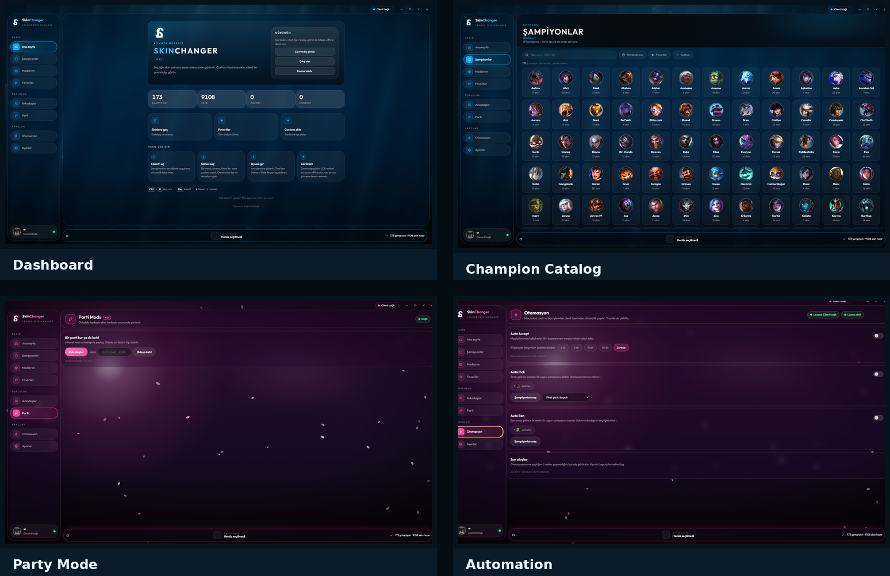
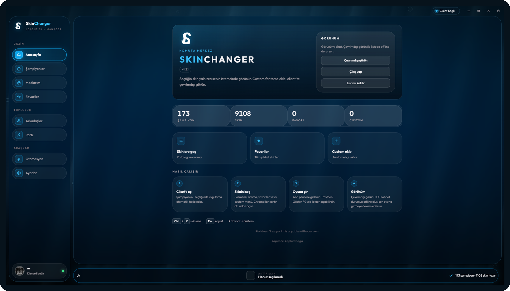
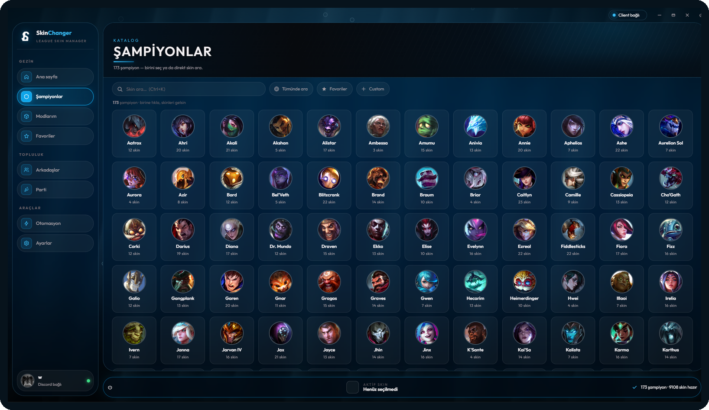
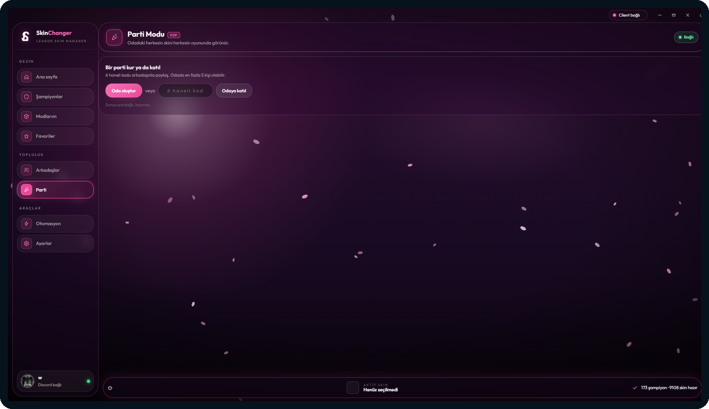
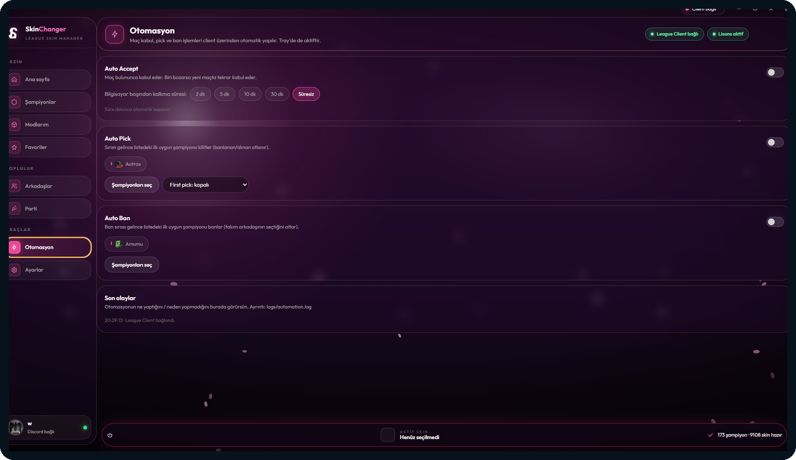

# SkinChanger

> A modern League of Legends skin management utility with a clean desktop interface.

SkinChanger is a desktop application designed to make local League of Legends skin management simple and convenient. It provides a searchable champion catalog, skin selection, favorites, custom skin support, party mode, and optional gameplay automation features through a single interface.

**This repository contains presentation assets and release information only. Source code is intentionally not included.**

## ✨ Features

- **Champion & Skin Catalog** — Browse champions and their available skins from a searchable interface.
- **Skin Selection** — Quickly select the skin you want to use.
- **Favorites** — Keep frequently used skins in one place.
- **Custom Skins** — Add and manage custom `.fantome` packages.
- **Party Mode** — Share the same skin experience with other users in a party session.
- **Automation** — Optional Auto Accept, Auto Pick and Auto Ban helpers.
- **League Client Detection** — Automatically detects the League Client when available.
- **Modern UI** — Dark, responsive interface designed around fast navigation.
- **Keyboard Shortcuts** — Quick access to skin search and navigation.

## 🖥️ Screenshots



### Dashboard



### Champion Catalog



### Party Mode



### Automation



## 🚀 Download

Download the latest compiled release from the **Releases** section:

**[Download the latest version →](../../releases/latest)**

The application is distributed as a compiled build. This repository does **not** contain the application's source code.

## 🔄 Updates

SkinChanger can use GitHub Releases as its update channel.

Each published release can contain:

- Windows application package
- Version information
- Release notes
- Checksums, when provided

The application can check the latest GitHub Release and notify the user when a newer version is available.

## 📋 Requirements

- Windows 10 / 11
- League of Legends installed
- An active League Client session for client-related features

Some features may require the application to be started with appropriate permissions depending on the local system configuration.

## ⚠️ Disclaimer

SkinChanger is an independent third-party project and is **not affiliated with, endorsed by, or sponsored by Riot Games**.

League of Legends and related assets are trademarks of Riot Games. Use the application at your own discretion and make sure your use complies with the applicable game rules and policies.

## 📦 Repository Structure

```text
SkinChanger/
├── README.md
├── screenshots/
│   ├── dashboard.png
│   ├── champions.png
│   ├── party-mode.png
│   └── automation.png
└── assets/
    └── showcase.png
```

## 📝 Release Notes

Release notes and version history are maintained through GitHub Releases.

---

**SkinChanger** — League skin management, simplified.
